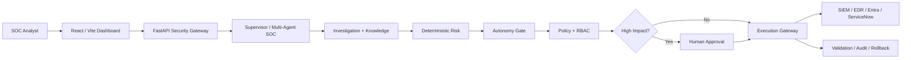

# SOAR Automation Agent

**Phase 10 — Production Governed Autonomous SOC**  
Prepared by **Isam Al Rikabi**

## Operational Documentation

- [Phase 10 How-to-Run Book](docs/runbooks/Phase10-How-to-Run-Book.md)
- [Phase 10 Operational Runbook](docs/runbooks/Phase10-Operational-Runbook.md)
- [Phase 10 Standard Operating Procedures](docs/sops/Phase10-SOP-Manual.md)

## Architecture and Flowcharts

- [Operational Architecture](docs/diagrams/architecture.md)
- [Startup and Validation Flow](docs/diagrams/startup-flow.md)
- [Incident Investigation and Response Flow](docs/diagrams/incident-response-flow.md)
- [Troubleshooting Flow](docs/diagrams/troubleshooting-flow.md)

All diagrams use GitHub-native Mermaid and render directly in the repository.

## Architecture



## Safety Baseline

```env
RESPONSE_EXECUTION_MODE=mock
AUTONOMY_LEVEL=recommend
AUTONOMY_KILL_SWITCH=false
DETECTION_AUTO_DEPLOY=false
```

- AI agents investigate and recommend; they do not bypass deterministic execution controls.
- High-impact response actions remain policy, RBAC, and human-approval gated.
- `delete_resource` remains denied by policy.
- Read-only/mock connectors are the preferred initial operating mode.

## Local URLs

- SOC Dashboard: `http://localhost:5173`
- API: `http://127.0.0.1:8080`
- API Documentation: `http://127.0.0.1:8080/docs`

## Owner

**Isam Al Rikabi**
