# Phase 10 SOAR Operational Architecture

```mermaid
flowchart LR
    A[SOC Analyst / Browser] --> B[React / Vite SOC Dashboard]
    B --> C[FastAPI Security Gateway]
    C --> D[Supervisor / Multi-Agent SOC]
    D --> E[Investigation + Evidence Intelligence]
    D --> F[Knowledge / RAG / MITRE / CVE Context]
    E --> G[Deterministic Risk Engine]
    F --> G
    G --> H[Autonomy Gate]
    H --> I[Policy Engine]
    I --> J[RBAC]
    J --> K{High-impact action?}
    K -- Yes --> L[Human Approval]
    K -- No --> M[Execution Gateway]
    L --> M
    M --> N[SIEM / EDR / Entra / ServiceNow]
    M --> O[Validation / Rollback]
    O --> P[Audit / Metrics / Evidence]
    N --> P
```

## Control Boundary

AI components may investigate, correlate, draft detections, recommend actions, and recommend playbooks. They do not bypass deterministic policy, RBAC, approval, governance, or the execution gateway.
