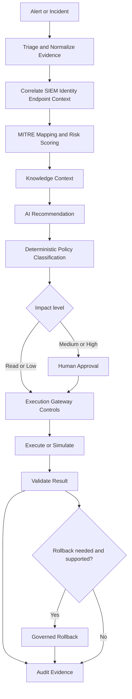

# Incident Investigation and Response Flow

AI recommendations are advisory. State-changing actions remain subject to deterministic policy, role authorization, approval requirements, and the execution gateway.
