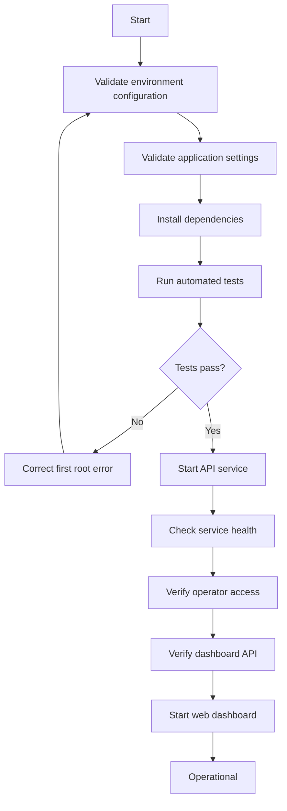

# Startup and Validation Flow

```mermaid
flowchart TD
    A[Start] --> B[Validate environment configuration]
    B --> C[Validate application settings]
    C --> D[Install dependencies]
    D --> E[Run automated tests]
    E --> F{Tests pass?}
    F -- No --> G[Correct first root error]
    G --> B
    F -- Yes --> H[Start API service]
    H --> I[Check service health]
    I --> J[Verify operator access]
    J --> K[Verify dashboard API]
    K --> L[Start web dashboard]
    L --> M[Operational]
```
