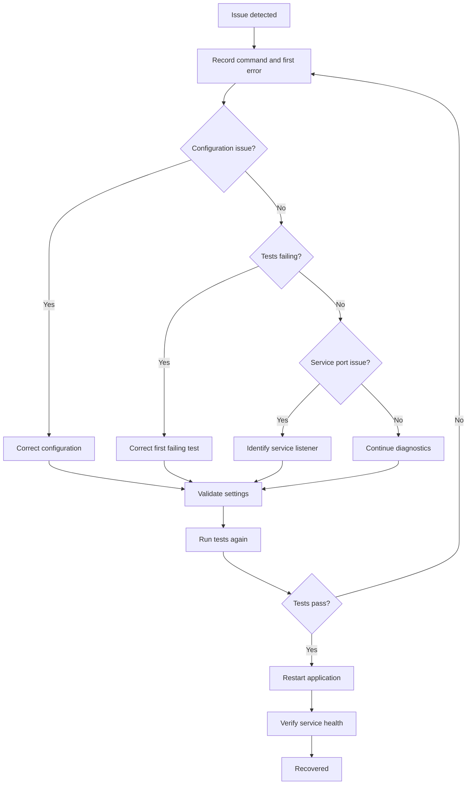

# Troubleshooting Flow

```mermaid
flowchart TD
    A[Issue detected] --> B[Record command and first error]
    B --> C{Configuration issue?}
    C -- Yes --> D[Correct configuration]
    C -- No --> E{Tests failing?}
    E -- Yes --> F[Correct first failing test]
    E -- No --> G{Service port issue?}
    G -- Yes --> H[Identify service listener]
    G -- No --> I[Continue diagnostics]
    D --> J[Validate settings]
    F --> J
    H --> J
    I --> J
    J --> K[Run tests again]
    K --> L{Tests pass?}
    L -- No --> B
    L -- Yes --> M[Restart application]
    M --> N[Verify service health]
    N --> O[Recovered]
```
