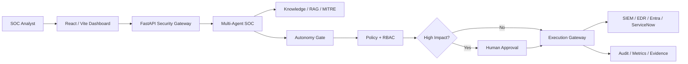

# SOAR Automation Agent — Phase 10 How to Run Book

**Production Governed Autonomous SOC**  
**Prepared by:** Isam Al Rikabi  
**Version:** 1.0 — September 2026

## Purpose

This guide provides the Windows/PowerShell procedure to configure, validate, start, verify, and stop the Phase 10 SOAR Automation Agent.

## Architecture



## Prerequisites

- Windows 10/11 PowerShell
- Python and pip
- Node.js and npm
- Git
- Repository cloned to `C:\soar-automation-agent-main`

## First-Time Configuration

```powershell
cd C:\soar-automation-agent-main
Copy-Item .env.example .env -Force
```

Use safe local defaults:

```env
RESPONSE_EXECUTION_MODE=mock
AUTONOMY_LEVEL=recommend
AUTONOMY_KILL_SWITCH=false
DETECTION_AUTO_DEPLOY=false
```

### Remove obsolete setting

If an earlier `.env` contains `KNOWLEDGE_REFRESH_MODE`, remove it:

```powershell
Copy-Item .\.env .\.env.backup -Force
(Get-Content .\.env) |
  Where-Object { $_ -notmatch '^\s*KNOWLEDGE_REFRESH_MODE\s*=' } |
  Set-Content .\.env

Select-String .\.env -Pattern "KNOWLEDGE_REFRESH_MODE"
```

Expected result: no output.

## Validate Configuration

```powershell
python -c "from src.config.settings import get_settings; get_settings(); print('SETTINGS OK')"
```

Expected:

```text
SETTINGS OK
```

## Install and Test Backend

```powershell
python -m pip install -e ".[dev]"
python -m pytest -q
```

Do not continue if tests fail.

## Start Phase 10 Backend

```powershell
powershell -ExecutionPolicy Bypass `
  -File .\scripts\start-phase10-windows.ps1
```

Expected backend URL:

- `http://127.0.0.1:8080`
- Swagger/OpenAPI: `http://127.0.0.1:8080/docs`

## Verify Backend

```powershell
Invoke-RestMethod http://127.0.0.1:8080/health
```

Authentication test:

```powershell
$headers = @{ "X-API-Key" = "dev-local-analyst-key" }
Invoke-RestMethod `
  http://127.0.0.1:8080/api/v1/auth/me `
  -Headers $headers
```

Dashboard API test:

```powershell
Invoke-RestMethod `
  http://127.0.0.1:8080/api/v1/dashboard/overview `
  -Headers $headers | ConvertTo-Json -Depth 10
```

## Start SOC Dashboard

```powershell
cd C:\soar-automation-agent-main\frontend
if (!(Test-Path .env)) { Copy-Item .env.example .env }
npm install
npm run dev
```

Expected frontend URL:

- `http://localhost:5173`

Frontend configuration:

```env
VITE_API_BASE=http://127.0.0.1:8080
VITE_API_KEY=dev-local-analyst-key
```

## Demonstration Investigation

```powershell
Invoke-RestMethod `
  http://127.0.0.1:8080/api/v1/investigations/INC-10234 `
  -Headers $headers | ConvertTo-Json -Depth 10
```

## Governance Validation

```powershell
Invoke-RestMethod `
  http://127.0.0.1:8080/api/v1/governance/summary `
  -Headers $headers | ConvertTo-Json -Depth 10
```

Initial testing must preserve these boundaries:

- AI investigates and recommends; it does not bypass execution controls.
- High-impact actions require deterministic policy, RBAC, and human approval.
- `delete_resource` remains denied.
- Response execution remains mock/simulation-only during initial testing.

## Normal Daily Startup

Terminal 1:

```powershell
cd C:\soar-automation-agent-main
powershell -ExecutionPolicy Bypass -File .\scripts\start-phase10-windows.ps1
```

Terminal 2:

```powershell
cd C:\soar-automation-agent-main\frontend
npm run dev
```

## Stop Application

Use `Ctrl+C` in the frontend and backend terminals, then verify ports:

```powershell
netstat -ano | findstr :8080
netstat -ano | findstr :5173
```

## Success Criteria

- Configuration validates.
- Tests pass.
- Backend listens on `127.0.0.1:8080`.
- `/health` responds successfully.
- Authentication succeeds.
- Dashboard loads at `localhost:5173`.
- Investigation and governance APIs return expected results.
- State-changing controls remain governed.
