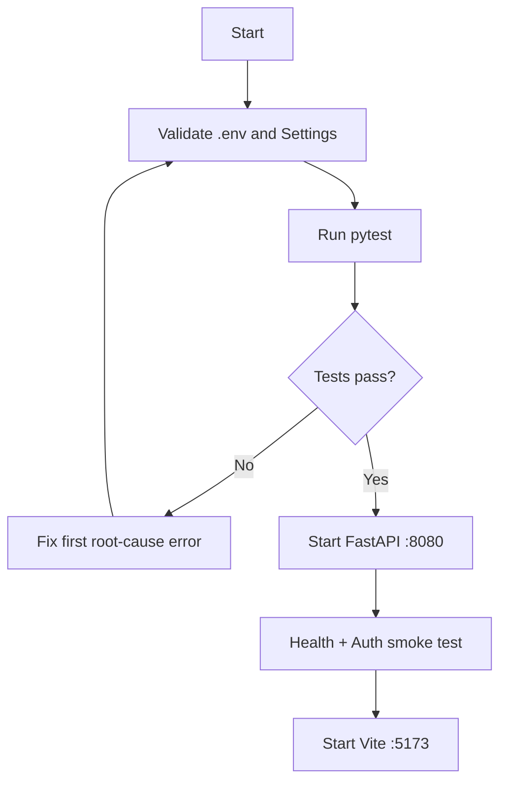
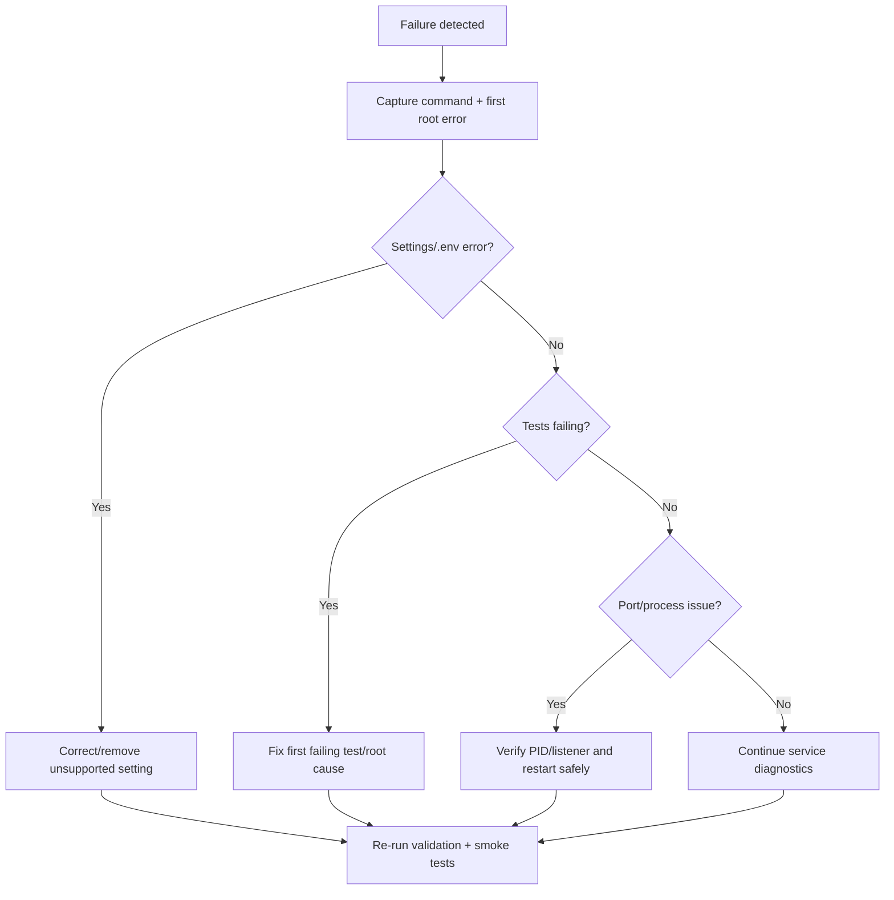

# SOAR Automation Agent — Phase 10 Operational Runbook

**Prepared by:** Isam Al Rikabi  
**Version:** 1.0 — September 2026

## Purpose

Repeatable procedures for starting, validating, operating, stopping, troubleshooting, recovering, and preparing the Phase 10 SOAR Automation Agent for production.

## Service Inventory

| Service | Default Address | Function | Expected State |
|---|---|---|---|
| FastAPI Backend | `127.0.0.1:8080` | SOAR APIs, agents, governance | Running |
| React/Vite Frontend | `localhost:5173` | SOC dashboard | Running |
| SQLite/local persistence | Project data path | Development persistence | Available |
| Microsoft connectors | Mock/read-only default | Sentinel/Defender/Entra evidence | Healthy/mock |
| ServiceNow connector | Mock default | Case/ticket workflow | Healthy/mock |

## Safety Baseline

```env
RESPONSE_EXECUTION_MODE=mock
AUTONOMY_LEVEL=recommend
AUTONOMY_KILL_SWITCH=false
DETECTION_AUTO_DEPLOY=false
```

## Pre-Start Checklist

- [ ] Repository exists locally.
- [ ] Python, pip, Node.js, and npm are installed.
- [ ] `.env` exists and contains only supported settings.
- [ ] Obsolete `KNOWLEDGE_REFRESH_MODE` is removed.
- [ ] Backend tests pass.
- [ ] Port 8080 is available.
- [ ] Frontend points to `127.0.0.1:8080`.

## Startup Flow



## Startup Procedure

```powershell
cd C:\soar-automation-agent-main
python -c "from src.config.settings import get_settings; get_settings(); print('SETTINGS OK')"
python -m pytest -q
powershell -ExecutionPolicy Bypass -File .\scripts\start-phase10-windows.ps1
```

Verify:

```powershell
Invoke-RestMethod http://127.0.0.1:8080/health
$headers = @{ "X-API-Key" = "dev-local-analyst-key" }
Invoke-RestMethod http://127.0.0.1:8080/api/v1/auth/me -Headers $headers
```

Frontend:

```powershell
cd C:\soar-automation-agent-main\frontend
npm install
npm run dev
```

## Daily Operations

1. Confirm backend health.
2. Confirm authenticated identity and roles.
3. Confirm connector health/read-only or mock state.
4. Review active incidents and investigations.
5. Preserve evidence and audit records.
6. Route response actions through policy/RBAC/approval.
7. Validate or rollback supported executions.

## Investigation Smoke Test

```powershell
Invoke-RestMethod `
  http://127.0.0.1:8080/api/v1/investigations/INC-10234 `
  -Headers $headers | ConvertTo-Json -Depth 10
```

## Controlled Shutdown

Use `Ctrl+C` in frontend and backend terminals. Verify:

```powershell
netstat -ano | findstr :8080
netstat -ano | findstr :5173
```

Do not terminate an unknown PID. Identify it first:

```powershell
Get-Process -Id <PID>
```

## Response Operating Procedure

1. Investigate and collect evidence.
2. Review deterministic risk and policy output.
3. Classify response action impact.
4. Enforce RBAC.
5. Require human approval for high-impact actions.
6. Dispatch only through the execution gateway.
7. Validate result.
8. Preserve audit evidence.
9. Use rollback only where supported.

## Troubleshooting



### Known Phase 10 configuration error

If Pydantic reports `knowledge_refresh_mode` as an extra/forbidden input:

```powershell
(Get-Content .\.env) |
  Where-Object { $_ -notmatch '^\s*KNOWLEDGE_REFRESH_MODE\s*=' } |
  Set-Content .\.env

python -c "from src.config.settings import get_settings; get_settings(); print('SETTINGS OK')"
python -m pytest -q
```

## Recovery Procedure

```powershell
cd C:\soar-automation-agent-main
Copy-Item .env .env.recovery-backup -Force
python -c "from src.config.settings import get_settings; get_settings(); print('SETTINGS OK')"
python -m pip install -e ".[dev]"
python -m pytest -q
powershell -ExecutionPolicy Bypass -File .\scripts\start-phase10-windows.ps1
```

Do not delete persistent evidence or audit data as a generic repair step.

## Production Readiness Gate

- [ ] `APP_ENV=production`.
- [ ] Application and JWT secrets are rotated and strong.
- [ ] Enterprise storage is configured.
- [ ] Production secret provider is not plain environment storage.
- [ ] Detection auto-deployment remains governed.
- [ ] Autonomy kill-switch capability is available.
- [ ] Human approval remains mandatory for high-impact actions.
- [ ] Grounding and MITRE precision evaluation thresholds pass.
- [ ] No policy violations or unsafe-action attempts are present.

## Escalation Data

Capture command, first traceback/root error, project version/commit, Python and Node versions, non-secret configuration state, pytest summary, port/PID output, and `/health` response. Never include passwords, tokens, client secrets, or private keys.
