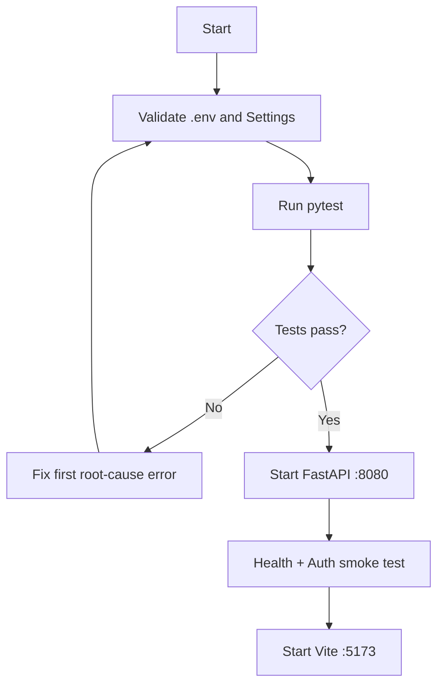
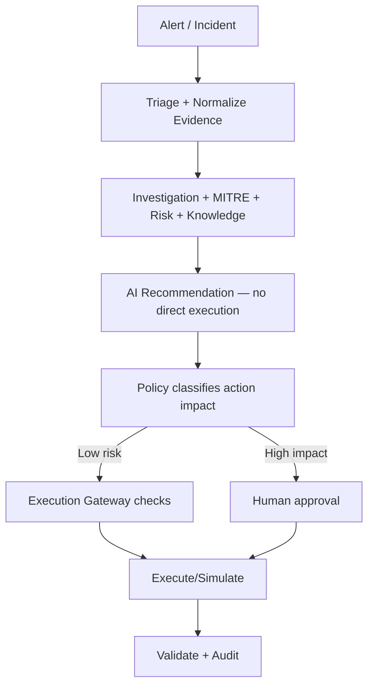
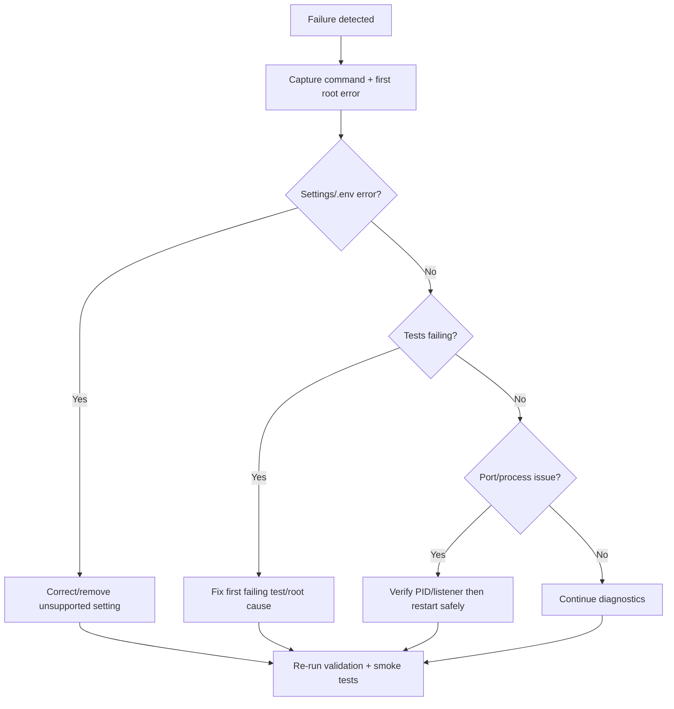

# SOAR Automation Agent — Phase 10 Standard Operating Procedures

**Production Governed Autonomous SOC**  
**Prepared by:** Isam Al Rikabi  
**Version:** 1.0 — September 2026

## Document Control

| Field | Value |
|---|---|
| Owner | Isam Al Rikabi |
| Platform | SOAR Automation Agent |
| Classification | Internal / Operational |
| Default Mode | Mock / Recommend |
| Production Use | Subject to production gate |

## 1. Purpose and Scope

These SOPs define repeatable procedures for startup, daily health checks, incident investigation, governed response, approvals, shutdown, troubleshooting, recovery, backup, release validation, and production readiness.

## 2. Roles and Responsibilities

| Role | Primary Responsibility | Control Boundary |
|---|---|---|
| Analyst | Review alerts, evidence, investigations, recommendations | Read/investigate |
| Investigator | Correlate SIEM, identity, endpoint, MITRE, and knowledge evidence | No direct high-impact execution |
| Responder | Submit governed response actions | Policy/RBAC enforced |
| Approver | Approve/reject high-impact actions | Human authorization |
| Administrator | Platform configuration, secrets, readiness | No bypass of policy/audit |
| AI Agents | Triage, investigate, correlate, recommend, report | `execution_authorized=false` |

---

# SOP-01 — Start and Validate the Platform

**Objective:** Start backend and frontend only after configuration and automated tests pass.



### Procedure

1. Open PowerShell and enter `C:\soar-automation-agent-main`.
2. Confirm `.env` exists; create it from `.env.example` when required.
3. Remove obsolete `KNOWLEDGE_REFRESH_MODE` if present.
4. Validate settings.
5. Run `python -m pytest -q`.
6. Do not bypass a failing test gate.
7. Start Phase 10 backend.
8. Verify `/health` and `/api/v1/auth/me`.
9. Start the frontend and open `localhost:5173`.

```powershell
cd C:\soar-automation-agent-main
python -c "from src.config.settings import get_settings; get_settings(); print('SETTINGS OK')"
python -m pytest -q
powershell -ExecutionPolicy Bypass -File .\scripts\start-phase10-windows.ps1
```

### Acceptance Criteria

- Tests pass.
- Uvicorn listens on `127.0.0.1:8080`.
- `/health` responds.
- Authentication succeeds.
- Vite serves the SOC dashboard.

---

# SOP-02 — Daily SOC Operator Login and Health Check

**Objective:** Confirm service health before SOC work begins.

```powershell
$headers = @{ "X-API-Key" = "dev-local-analyst-key" }
Invoke-RestMethod http://127.0.0.1:8080/health
Invoke-RestMethod http://127.0.0.1:8080/api/v1/auth/me -Headers $headers
Invoke-RestMethod http://127.0.0.1:8080/api/v1/connectors/health -Headers $headers
```

Verify expected identity, roles, and connector mode. Never expose production tokens or secrets in tickets, logs, or chats.

---

# SOP-03 — Incident Investigation and Evidence Handling

**Objective:** Investigate alerts using normalized evidence, MITRE mapping, deterministic risk, and knowledge retrieval before proposing response.



### Procedure

1. Open/retrieve the incident.
2. Normalize and review evidence from approved read-only sources.
3. Review entities, confidence, source correlation, risk, and MITRE mappings.
4. Use knowledge context to support—not replace—source evidence.
5. Confirm AI recommendations are grounded.
6. Select an approved playbook or response recommendation.
7. Route high-impact actions through policy, RBAC, and human approval.
8. Validate results and preserve audit evidence.

Example:

```powershell
Invoke-RestMethod `
  http://127.0.0.1:8080/api/v1/investigations/INC-10234 `
  -Headers $headers | ConvertTo-Json -Depth 10
```

---

# SOP-04 — Governed Response and Approval

**Objective:** Ensure response actions cannot bypass deterministic controls.

| Class | Examples | Approval | Execution |
|---|---|---|---|
| Read | `search_logs`, `read_alert`, `lookup_ioc` | No | Read-only |
| Low | `create_ticket`, `update_ticket` | Normally no | Gateway controlled |
| Medium | `block_ip` | Required | Governed |
| High | `revoke_sessions`, `isolate_endpoint`, `disable_user` | Required | Governed |
| Denied | `delete_resource` | N/A | Denied |

### Mandatory Controls

- LLM/agent recommendations never override policy.
- RBAC is checked before execution.
- High-impact actions require explicit human approval.
- Initial/local execution remains `RESPONSE_EXECUTION_MODE=mock`.
- Every attempted execution produces audit evidence.
- Rollback is used only where supported and validated.

---

# SOP-05 — Controlled Shutdown

1. Complete or pause active investigations/playbooks.
2. Press `Ctrl+C` in the Vite terminal.
3. Press `Ctrl+C` in the backend terminal.
4. Verify ports 5173 and 8080.
5. Record abnormal shutdown conditions.

```powershell
netstat -ano | findstr :5173
netstat -ano | findstr :8080
```

---

# SOP-06 — Troubleshooting and Recovery



### Known Phase 10 setting error

```powershell
Select-String .\.env -Pattern "KNOWLEDGE_REFRESH_MODE"
(Get-Content .\.env) |
  Where-Object { $_ -notmatch '^\s*KNOWLEDGE_REFRESH_MODE\s*=' } |
  Set-Content .\.env
python -c "from src.config.settings import get_settings; get_settings(); print('SETTINGS OK')"
python -m pytest -q
```

### Port Diagnostics

```powershell
netstat -ano | findstr :8080
Get-Process -Id <PID>
```

Confirm process ownership before termination.

---

# SOP-07 — Governance and Production Readiness

- [ ] `APP_ENV=production`.
- [ ] Application/JWT secrets rotated and strong.
- [ ] Enterprise storage enabled.
- [ ] Production secrets are not stored as plain environment secrets.
- [ ] Detection auto-deployment is governed.
- [ ] Autonomy kill switch is available.
- [ ] High-impact human approval remains enabled.
- [ ] Grounding and MITRE precision release thresholds pass.
- [ ] No policy violations or unsafe action attempts exist.

A failed production gate in local development is expected and must not be bypassed.

---

# SOP-08 — Backup, Evidence, and Audit Preservation

- Preserve investigation evidence, audit events, and approval records before maintenance.
- Use provided backup tooling where applicable.
- Do not delete local evidence stores as a generic troubleshooting action.
- Protect exported reports/logs according to organizational handling requirements.
- Record version, configuration mode, and timestamp with operational evidence.

```powershell
cd C:\soar-automation-agent-main
powershell -ExecutionPolicy Bypass -File .\scripts\backup-phase9.ps1
```

---

# SOP-09 — Change and Release Validation

1. Make changes in a controlled branch.
2. Run unit and integration tests.
3. Validate Settings/environment compatibility.
4. Review policy, RBAC, approval, execution, and autonomy changes.
5. Run release/evaluation gate tests.
6. Deploy to non-production first.
7. Perform health, authentication, investigation, and governance smoke tests.
8. Promote only after blockers are cleared.

## Quick Command Card

```powershell
python -c "from src.config.settings import get_settings; get_settings(); print('SETTINGS OK')"
python -m pytest -q
powershell -ExecutionPolicy Bypass -File .\scripts\start-phase10-windows.ps1
Invoke-RestMethod http://127.0.0.1:8080/health
cd C:\soar-automation-agent-main\frontend
npm run dev
```

URLs:

- `http://localhost:5173`
- `http://127.0.0.1:8080/docs`
